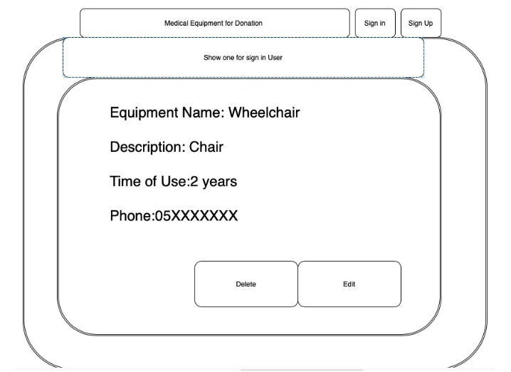
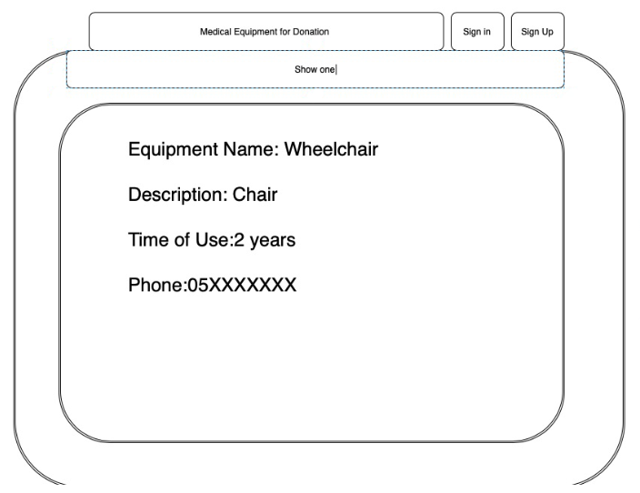

# Medical-Equipment-for-Donation

### Descriprtion 
It is a Full-Stack Ruby on rails web application that allow user to Donate Medical Equipment and Hospital Requests.

####  Deployed Website Link

### User Stories 
- As a User I can Add New Eqipment .
- As a User I can Delete any of my Equipments. 
- As a User I can Edit the information of my Equipment .
- As a User I can See the information of One of my Equipment .
- As a User I can See the list of the Equipment System .
- As a User I can see the list of Hospitl Requests.
- As a User I can Add New Hospital Requests To donate .
- As a User I can Delete any of my Hospital Requests . 

### Tools 
- Ruby on rails 
- Bootsrab 
- CSS
- SCSS
- VS code.
- Trello.
- draw.io.

#### The Wireframe 

#### ER Diagram 

#### Future Work 

- Search Function .
- Full CRUD for Hospital .
- Adding image to the Equipment .
  